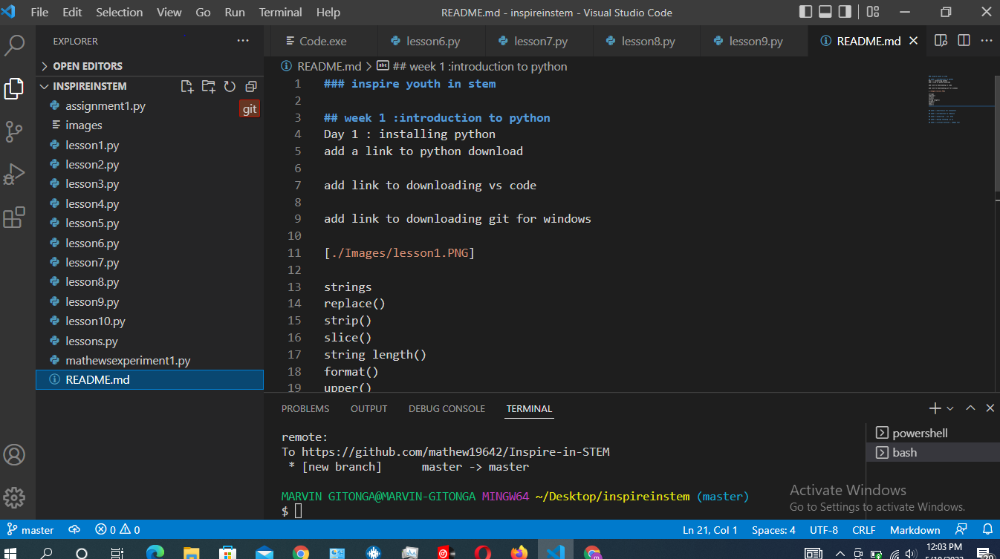

### inspire youth in stem

### git commands
git config --global user.name"mathew19642"
git config --global user.email"mathewgitonga761@gmail.com"
git add *
git commit -m "lessons"
git push

## week 1 :introduction to python
Day 1 : installing python
add a link to python download

day 4 :lists
       working with lists
       loops
       

add link to downloading vs code

add link to downloading git for windows

strings
replace()
strip()
slice()
string length()
format()
upper()
lower()

## week 2 :electronics for innovators
# what are dictionaries   are a collection of key value pairs
syntax for dictionaries
define add remove
looping over dictionaries
dic in list,list in dic,dic in ist

## week 3 :introduction to robotics

## week 4 :javascript . css  html

## week 5 :design thinking ,ux ui

## week 6 :critical division , campus tour
